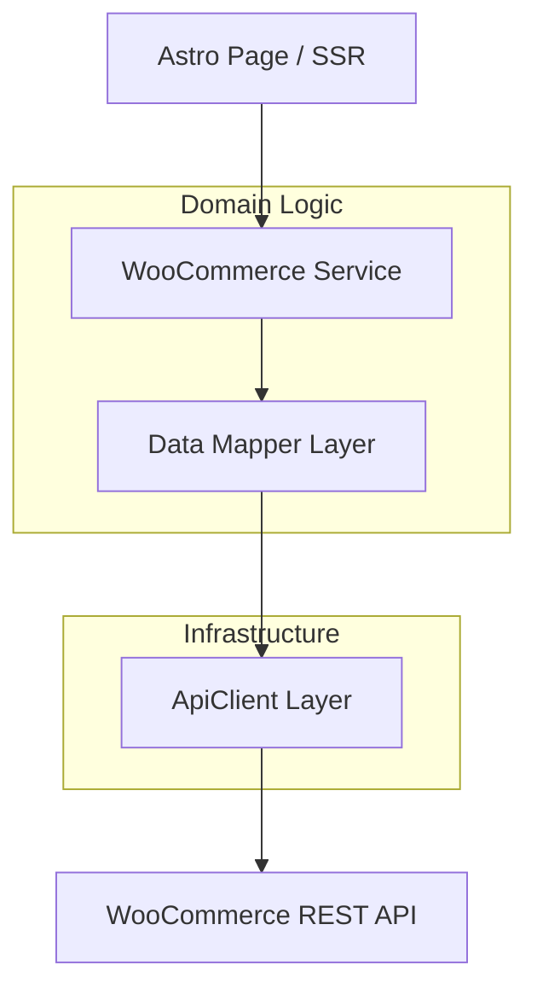

# Floravelle: Master Integration Guide for WooCommerce API

This master guide serves as the definitive technical blueprint for the Floravelle e-commerce engine. It outlines a high-performance, resilient, and type-safe architecture designed to scale with the brand.

---

## 1. Architectural Blueprint

We employ a **Multi-Layered Service Architecture**. This ensures that the frontend remains "ignorant" of the backend's specific quirks, allowing for maximum flexibility.



---

## 2. Layer-by-Layer Deep Dive

### 2.1 The Infrastructure Layer: `ApiClient`
The `ApiClient` is the gatekeeper of all network traffic.

**Advanced Features implemented:**
- **Dynamic Auth**: Automatically encodes credentials for every request.
- **Contextual Errors**: Instead of generic alerts, it parses WooCommerce's specific error codes (e.g., `woocommerce_rest_invalid_id`).
- **Singleton Guard**: Prevents multiple initializations that could lead to memory leaks or credential exposure.

### 2.2 The Mapping Layer: Data Transformation
WooCommerce's default responses are heavily nested and verbose. We use the **DTO (Data Transfer Object) Pattern** to sanitize this data.

**Implementation Principle:**
Never pass raw API objects directly to your components. Always map them to a local interface first.

```typescript
/** 
 * Example: Mapping custom olfactory notes 
 * WooCommerce stores these in an attributes array. 
 * We map them to a flat 'notes' object for easy access.
 */
const mapNotes = (attributes: any[]) => ({
  top: attributes.find(a => a.name === "Top Notes")?.options[0] || "None",
  heart: attributes.find(a => a.name === "Heart Notes")?.options[0] || "None",
  base: attributes.find(a => a.name === "Base Notes")?.options[0] || "None",
});
```

### 2.3 The Service Layer: `WoocommerceService`
This layer handles the "Business Rules." 

**Core Responsibilities:**
- **Filtering**: Translating frontend requests (e.g., "show me perfumes") into API parameters (`?category=perfumes`).
- **Aggregation**: Combining data from multiple endpoints if necessary.
- **Resilience**: Providing empty fallbacks (`[]`) if the backend is down, ensuring the site doesn't crash.

---

## 3. Advanced Implementation Patterns

### 3.1 Robust Error Handling with `ApiError`
We use a custom error class to bridge the gap between the server and the user.

```typescript
export class ApiError extends Error {
  constructor(
    public message: string,
    public status: number,
    public data: any,
    public response: Response
  ) {
    super(message);
    this.name = 'ApiError';
  }
}
```
**Usage**: When a checkout fails, the `WoocommerceService` can catch this error and return a user-friendly message based on the `status` code (e.g., 401 for "Session Expired", 400 for "Out of Stock").

### 3.2 Handling Pagination & Large Catalogs
WooCommerce limits responses to 10-100 items. For a large collection, use the `get` method with params:

```typescript
async getCollection(page = 1, perPage = 20) {
  return this.api.get('/products', {
    page: page.toString(),
    per_page: perPage.toString(),
    status: 'publish'
  });
}
```

---

## 4. Scalability & Performance Strategy

### 4.1 In-Memory Caching
To reduce latency, implement a simple cache for product lists that change infrequently.
```typescript
private cache = new Map<string, {data: any, expiry: number}>();

async getCachedProducts() {
  const now = Date.now();
  if (this.cache.has('all') && this.cache.get('all')!.expiry > now) {
    return this.cache.get('all')!.data;
  }
  // ... fetch and set cache with expiry
}
```

### 4.2 Webhook Integration (Future)
To handle real-time inventory updates, set up a webhook endpoint in Astro that listens for `product.updated` events from WooCommerce. This ensures your stock counts are always 100% accurate without constant polling.

---

## 5. Security & Production Checklist

> [!CAUTION]
> **CRITICAL SECURITY RULE**: 
> Never import `client.ts` or `woocommerce.ts` in any file that runs in the browser. 
> These services must be kept strictly on the **Server Side** to protect your Consumer Secret.

1. **Environment Audit**: Ensure `.env` is in `.gitignore`.
2. **Input Sanitization**: Always use `encodeURIComponent` for any user-provided search queries.
3. **Logging**: Use a professional logger (like `pino` or `winston`) in production to track API failures without exposing sensitive data in client logs.

---

## 6. Development Workflow
1. **Define Types**: Always start by updating `types.ts` when adding new API features.
2. **Update Mapper**: Ensure the data transformation logic handles the new fields.
3. **Expose Service**: Add the method to `WoocommerceService`.
4. **Consume in Astro**: Call the service in your `.astro` frontmatter.

